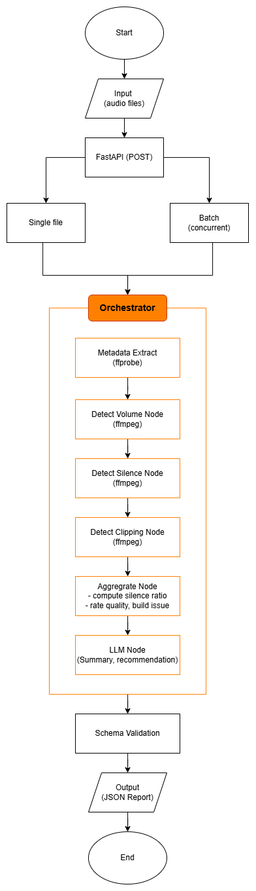

# Audio Analysis Agent

AI system for analyzing audio recordings. It extracts
audio metadata, detects quality issues (silence, clipping, low volume), and
generates human readable insights and recommendations using an LLM.

**Built for the VoiceScript AI Engineer assessment.**

## Architecture



The pipeline is built as a sequential LangGraph graph. Each node runs one
analysis step, and the final state is validated against a Pydantic schema
before being returned.

- `metadata`, `volume`, `silence`, `clipping` : each calls an ffprobe/ffmpeg
  tool via subprocess and writes its result into shared agent state.
- `aggregate` : combines all tool outputs, computes `silence_ratio`, applies
  quality rules to determine `quality_rating` and `issues`.
- `llm` : sends the aggregated report to an LLM to generate
  a insight summary and recommendation.

The final report is validated against the `AudioReport` Pydantic schema
(`schemas/report.py`) to guarantee consistent structured output.

Three entry points are built on top of the same core pipeline:

- **CLI** (`agent/orchestrator.py`) : analyze a single file
- **Batch processor** (`batch/processor.py`) : analyze all files in
  `audio_files/` concurrently and produce an aggregated report
- **REST API** (`main.py`) : FastAPI server exposing `/analyze` and `/batch`
- **MCP server** (`mcp_server/server.py`) : exposes core ffmpeg/ffprobe tools
  via FastMCP for integration with other agents or LLM clients

## Project Structure

```
audio-analysis-agent/

├── main.py                  FastAPI entry point
├── agent/
│   ├── orchestrator.py      LangGraph pipeline
│   └── rules.py             quality rating + issue generation rules
├── tools/
│   ├── ffprobe_tool.py      metadata extraction
│   ├── volume_tool.py       avg/max volume detection
│   ├── silence_tool.py      silence segment detection
│   └── clipping_tool.py     clipping detection
├── llm/
│   └── summarizer.py        LLM summary + recommendation
├── schemas/
│   └── report.py            Pydantic output schema
├── mcp_server/
│   └── server.py            FastMCP server
├── batch/
│   └── processor.py         concurrent batch processing
├── audio_files/             input audio files
├── outputs/                 batch report output (batch_report.json)
├── requirements.txt
└── .env.example
```

## Tech Stack

| Component | Tool |
|---|---|
| Audio analysis | ffprobe + ffmpeg |
| LLM | OpenRouter API (`openai/gpt-oss-120b:free`) |
| LLM client | OpenAI library (OpenAI-compatible) |
| Structured output | Pydantic |
| Agent / pipeline | LangGraph |
| MCP | FastMCP |
| API | FastAPI + uvicorn |

## Setup & Installation

1. Clone the repo:
```bash
   git clone https://github.com/Alfian-Bima-Prastyo/Audio-Analysis-Agent.git
   cd Audio-Analysis-Agent
```

2. Create a virtual environment and install dependencies:
```bash
   python -m venv venv
   venv\Scripts\activate   # Windows
   pip install -r requirements.txt
```

3. Install [ffmpeg](https://ffmpeg.org/download.html) and make sure `ffmpeg`
   and `ffprobe` are available on your PATH.

4. Copy `.env.example` to `.env` and fill in your OpenRouter API key:
```bash
   cp .env.example .env
```
   Then edit `.env`:
   OPENROUTER_API_KEY=your_api_key

   5. Place audio files (`.mp3`, `.wav`, `.m4a`, `.flac`) into `audio_files/`.

## Usage

### Single file (CLI)
```bash
python -m agent.orchestrator audio_files/bad_audio.mp3
```

### Batch processing
```bash
python -m batch.processor
```
Writes aggregated results to `outputs/batch_report.json`.

### REST API
```bash
python main.py
```
Open `http://localhost:8000/docs` for the Swagger UI.

| Endpoint | Description |
|---|---|
| `GET /` | Health check |
| `POST /analyze?file_name=bad_audio.mp3` | Analyze a single file |
| `POST /batch` | Analyze all files in `audio_files/` |

### MCP server

```bash
python mcp_server/server.py
```
Exposes three tools: `get_audio_metadata`, `detect_silence`, `detect_clipping`.

Inspect available tools:
```bash
fastmcp inspect mcp_server/server.py
```

| MCP Tools | Description |
|---|---|
| `get_audio_metadata` | Extract duration, format, sample rate, bitrate, and channels |
| `detect_silence` | Detect silence segments with start/end timestamps |
| `detect_clipping` | Check for samples at 0dBFS (clipping indicator) |


## Output Format

```json
{
  "file_name": "bad_audio.mp3",
  "duration_seconds": 121.11,
  "format": "mp3",
  "sample_rate_hz": 16000,
  "bitrate_kbps": 47.2,
  "channels": 1,
  "audio_quality": {
    "avg_volume_db": -16.6,
    "max_volume_db": -0.4,
    "silence_ratio": 0.316,
    "clipping_detected": true,
    "clipping_sample_count": 779,
    "quality_rating": "poor"
  },
  "silence_segments": [
    { "start": 3.36, "end": 5.33, "duration": 1.97 },
    { "start": 32.39, "end": 39.43, "duration": 7.04 }
  ],
  "issues": [
    "Clipping detected: 779 samples at 0dBFS",
    "Low bitrate: 47.2 kbps is below recommended 128 kbps"
  ],
  "llm_summary": "The recording exhibits significant quality problems, including audible clipping and an extremely low bitrate, which will likely cause frequent transcription errors and missed speech content. The high silence ratio further reduces usable material, making reliable verbatim transcription difficult.",
  "recommendation": "Obtain a re-recording using a device set to at least 128 kbps, 44.1 kHz (or 48 kHz) and ensure proper gain staging to avoid clipping; if re-recording is impossible, supplement the transcript with a manual review of the audio to flag unintelligible sections."
}
```

Full example outputs (both test files) are available in `outputs/batch_report.json`.

## Design Decisions

**silence_ratio** is computed as `total silence duration / audio duration`
in the `aggregate` node. the silence tool only knows individual segments, not
total file duration, so the ratio is calculated after both tools have run.

**LangGraph**: is used as a sequential pipeline because the
analysis steps are deterministic and always run in the same fixed order,
simple, predictable, and easy to extend with new nodes without touching
existing ones.

**Hybrid design (deterministic core and generative edge)**: quality rating,
silence ratio, and issues are computed with rules.
The LLM is only invoked at the final step to produce human readable narrative insight.
So if the LLM is slow, fails, or hits a rate limit, the structured
report is still complete and valid.

**Batch processing**: uses `ThreadPoolExecutor` rather than multiprocessing
because the workload is I/O-bound (subprocess calls to ffmpeg and network
calls to the LLM API), not CPU-bound. Each file is wrapped in try/except so
one corrupt file does not fail the entire batch.

**Quality rating and issues** are derived by shared rule functions in
`agent/rules.py`, so both use a single source of truth for thresholds:

| Condition | Rating |
|---|---|
| Clipping detected | poor |
| silence_ratio > 0.3 | poor |
| sample_rate < 16000 Hz | poor |
| bitrate < 64 kbps | fair |
| avg_volume < -30 dBFS | fair |
| silence_ratio 0.15–0.3 | fair |
| None of the above | good |

Issues include: clipping, low bitrate, low sample rate, low average volume,
silence segments longer than 10s, and a potential clipping warning when
`max_volume_db > -1.0 dBFS` even without confirmed clipping. If no issues
are found, the field returns `["No major issues detected"]`.


## Considerations

- **LLM consistency and hallucination mitigation** : all numeric metrics
(volume, bitrate, silence_ratio, etc.) are computed deterministically by
ffmpeg tools before being passed to the LLM as context facts. The LLM is
only asked to narrate data it has already been given not to recall
it. Combined with low temperature (0.3), strict output format, and Pydantic
validation at the end of the pipeline, so the area for hallucination is
kept minimal.

- **Evaluating AI system quality** : evaluation is layered: unit tests for
deterministic tools and rule boundary conditions (silence_ratio threshold
at exactly 0.15/0.3, clipping priority over other ratings, etc.) are implemented
with pytest in `tests/test_rules.py` (20 tests, 20 passing).

- **Handling messy real world data** : the batch processor wraps each file in
try except and records errors without halting the run. Volume fields use. 
ffprobe failures raise explicit errors rather than silently returning
partial data. 

- **Accuracy vs latency vs cost** : the deterministic pipeline nodes (metadata,
volume, silence, clipping, aggregate) run in milliseconds with zero LLM cost.
The LLM call is the only variable cost, variable latency step, and it receives
a compact structured prompt regardless of audio duration. so cost stays flat
even for a 3600s deposition. For higher volume production use, results can be
cached by file hash to avoid redundant LLM calls on unchanged files.


## Limitations

- Free tier LLM models have rate limits., the summarizer retries with
  30s backoff on too many request errors (up to 3 attempts).
- The pipeline currently executes ffmpeg operations sequentially, which can reduce processing efficiency for large batches of audio files.
- Audio files must be placed manually in `audio_files/`, no upload endpoint
  is implemented in the current API.
